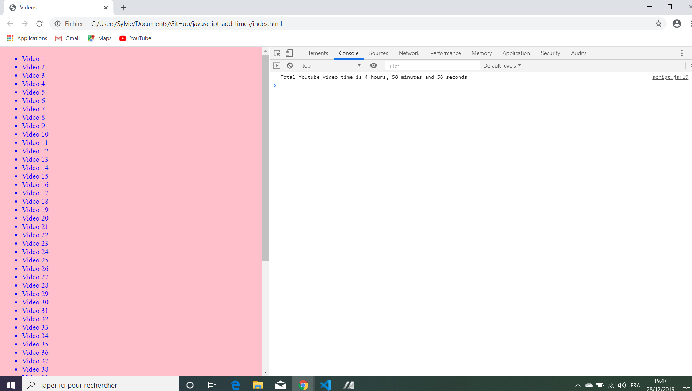

# :zap: Javascript Local Storage

* Wes Bos Youtube Javascript30 tutorial: [How JavaScript's Array Reduce Works - #JavaScript30 18/30](https://www.youtube.com/watch?v=SadWPo2KZWg&list=PLu8EoSxDXHP6CGK4YVJhL_VWetA865GOH&index=18).
* **Note:** to open web links in a new window use: _ctrl+click on link_


## :page_facing_up: Table of contents

* [General info](#general-info)
* [Screenshots](#screenshots)
* [Technologies](#technologies)
* [Setup](#setup)
* [Features](#features)
* [Status](#status)
* [Inspiration](#inspiration)
* [Contact](#contact)

## :books: General info

* Tutorial Code to understand how to sum time strings using the reduce function.

## :camera: Screenshots

.

## :signal_strength: Technologies

* [Javascript v1.9 ECMA-262 ECMAScript 2018](http://www.ecma-international.org/publications/standards/Ecma-262.htm)

## :floppy_disk: Setup

* Open index.html in browser. If any code is changed the browser needs to be refreshed.

## :computer: Code Examples

* Use map, split and reduce functions to obtain total seconds then convert to hours, moins and seconds.

```javascript
// turn secs:mins nodes into an array of strings then split into mins secs
// then use parsefloat function to return an array of numbers.
// then convert to a total seconds value
// then use reduce function to produce a total in seconds.
const seconds = timeNodes
  .map(node => node.dataset.time)
  .map(timeCode => {
    const [mins, secs] = timeCode.split(':').map(parseFloat);
    return (mins * 60) + secs;
  })
  .reduce((total, vidSeconds) => total + vidSeconds)

  let secondsLeft = seconds;
  const hours = Math.floor(secondsLeft / 3600);
  secondsLeft = secondsLeft % 3600; // leftover from minutes is seconds
  
const mins = Math.floor(secondsLeft / 60);
secondsLeft = secondsLeft % 60;
```

## :cool: Features

*  Gives total video play time in hours, mins & secs.

## :clipboard: Status & To-Do List

* Status: Working.
* To-Do: This code can be enhanced with html to show the time values from the javascript calculations.

## :clap: Inspiration

* Wes Bos Youtube Javascript30 tutorial [How JavaScript's Array Reduce Works - #JavaScript30 18/30](https://www.youtube.com/watch?v=SadWPo2KZWg&list=PLu8EoSxDXHP6CGK4YVJhL_VWetA865GOH&index=18)

## :file_folder: License

* N/A

## :envelope: Contact

* Repo created by [ABateman](https://github.com/AndrewJBateman), email: gomezbateman@yahoo.com
